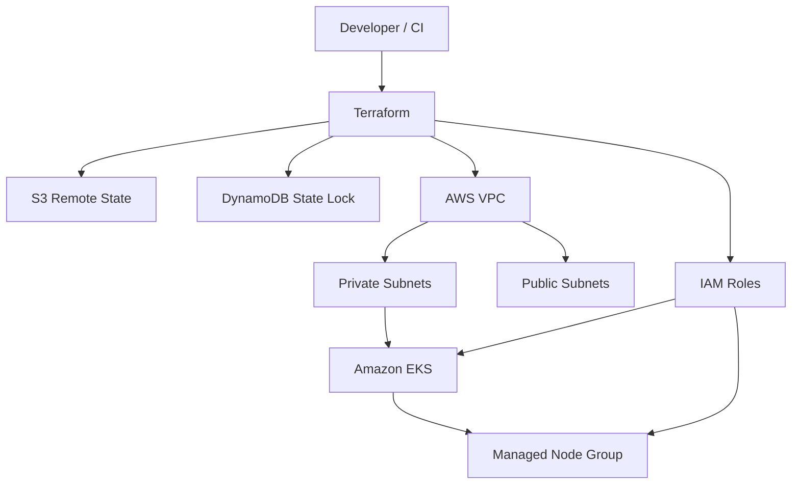

# AWS Terraform EKS Platform

Production-style Terraform portfolio project for provisioning an Amazon EKS platform with reusable VPC, IAM, and EKS modules, environment separation, remote state, and CI validation.

> **Portfolio safety:** this repository contains infrastructure code only. Applying it creates billable AWS resources such as EKS worker nodes and a NAT Gateway. Review the cost notes and cleanup steps before deploying.

## Architecture



See [docs/architecture.md](docs/architecture.md) for design notes.

## What this demonstrates

- Reusable Terraform modules rather than one large root configuration
- VPC networking across two Availability Zones
- Public and private subnet separation
- Amazon EKS with a managed node group in private subnets
- Purpose-specific IAM roles for the EKS control plane and worker nodes
- Separate development and production compositions
- Encrypted, versioned S3 remote state
- DynamoDB state locking for shared Terraform workflows
- CI checks for `terraform fmt` and `terraform validate`
- Safe examples instead of committed credentials or real `.tfvars` files

## Repository structure

```text
.
├── .github/
│   └── workflows/
│       └── terraform-validate.yml
├── bootstrap/
│   ├── main.tf
│   ├── outputs.tf
│   └── variables.tf
├── docs/
│   └── architecture.md
├── environments/
│   ├── dev/
│   └── prod/
├── modules/
│   ├── eks/
│   ├── iam/
│   └── vpc/
├── .gitignore
├── Makefile
├── SECURITY.md
└── versions.tf
```

## Prerequisites

Install:

- Terraform 1.6+
- AWS CLI v2
- Git
- kubectl (for cluster access after provisioning)

Authenticate to AWS with short-lived credentials where possible, for example IAM Identity Center or an assumed role.

Verify identity before making changes:

```bash
aws sts get-caller-identity
```

## 1. Bootstrap remote state

The `bootstrap/` configuration creates:

- an S3 bucket with versioning
- AES-256 server-side encryption
- public-access blocking
- a DynamoDB table keyed by `LockID`

Create your own local variables file (do not commit it):

```hcl
state_bucket_name = "your-globally-unique-state-bucket"
lock_table_name   = "terraform-state-locks"
aws_region        = "ap-south-1"
```

Then:

```bash
cd bootstrap
terraform init
terraform fmt -check
terraform validate
terraform plan
terraform apply
```

The bucket uses `prevent_destroy = true` to reduce accidental state loss. Removing the bootstrap resources later therefore requires an intentional lifecycle change after all environment state has been migrated or destroyed.

## 2. Configure an environment backend

Copy the example file locally:

```bash
cd environments/dev
cp backend.hcl.example backend.hcl
```

Replace the placeholder bucket and table names in `backend.hcl`.

Do not commit the populated backend file if it contains environment-specific information you do not want public.

Initialize:

```bash
terraform init -backend-config=backend.hcl
```

## 3. Review configuration

The example defaults target `ap-south-1` and two Availability Zones. Review them before deployment.

Optional local overrides can be placed in a non-committed `terraform.tfvars`.

Run:

```bash
terraform fmt -check -recursive
terraform validate
terraform plan
```

## 4. Deploy

Only apply after reviewing the plan and expected AWS cost:

```bash
terraform apply
```

After EKS is available:

```bash
aws eks update-kubeconfig --region ap-south-1 --name portfolio-dev-eks
kubectl get nodes
```

## Environment model

Both environments call the same modules.

| Environment | VPC CIDR | Node desired/min/max |
|---|---|---|
| dev | 10.10.0.0/16 | 2 / 1 / 3 |
| prod | 10.20.0.0/16 | 3 / 2 / 5 |

These are demonstration defaults, not universal production sizing recommendations.

## Remote state and locking

Terraform state is intentionally excluded from Git. The backend examples demonstrate S3 remote state and DynamoDB-based locking because this pattern is still common in enterprise estates.

For new real-world implementations, verify the current locking capabilities and recommendations for the Terraform version you deploy.

## CI validation

Pull requests and pushes to `master` run:

1. `terraform fmt -check -recursive`
2. `terraform init -backend=false`
3. `terraform validate`

for both dev and prod compositions.

No cloud deployment is performed by CI, so the workflow does not require AWS credentials.

## Security

See [SECURITY.md](SECURITY.md).

Key rules:

- never commit AWS access keys
- never commit Terraform state
- never commit real secret-bearing `.tfvars`
- never commit kubeconfig or private keys
- prefer short-lived AWS credentials

## Cost controls

EKS, EC2 worker nodes and NAT Gateway usage can incur AWS charges.

For learning/testing:

- review `terraform plan` before apply
- use the dev environment rather than prod
- reduce node counts where appropriate
- disable NAT Gateway only if your design can operate without private-subnet internet egress
- destroy test infrastructure when finished

## Cleanup

Destroy the environment before removing the remote-state bootstrap:

```bash
cd environments/dev
terraform destroy
```

Confirm that EKS and networking resources are gone in AWS.

The state bucket is protected with `prevent_destroy`; keep remote state until you have intentionally completed all environment cleanup.

## Local validation shortcuts

```bash
make fmt
make validate-dev
make validate-prod
```

## Interview discussion points

This repository is intentionally structured so the design can be explained during a technical interview:

- why remote state is required for teams
- how state locking prevents concurrent modification
- why worker nodes are placed in private subnets
- why modules and environment compositions are separated
- how IAM roles differ between the control plane and worker nodes
- why state and credentials must not be committed
- how CI can validate Terraform without AWS credentials

## Author

Pranay Saiteja Soppadandi  
GitHub: https://github.com/pranay9-h
