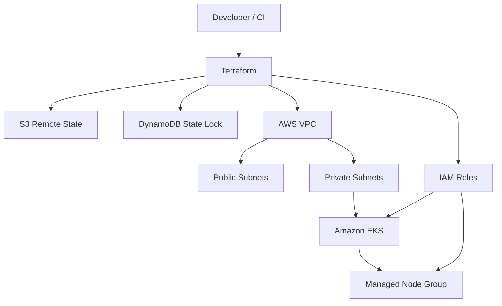

# Architecture

## Design choices

- EKS worker nodes run in private subnets.
- Public subnets are available for internet-facing load balancers and NAT egress.
- Terraform state is stored outside source control in an encrypted, versioned S3 bucket.
- DynamoDB locking is included to demonstrate a common enterprise team workflow.
- Development and production compose the same reusable modules with different inputs.
- NAT Gateway is enabled for realism but incurs AWS charges; disable it for low-cost experimentation when private egress is not needed.
